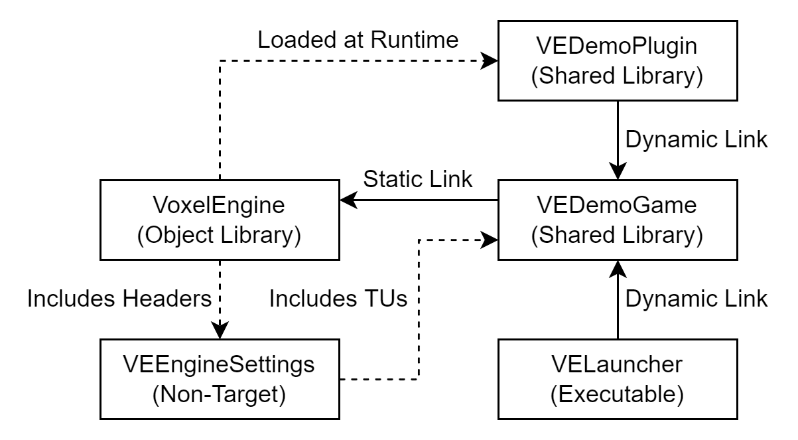

# ARCHITECTURE.md
This file contains some basic information about what components make up the engine and where to find them.  
It is meant as a help for people new to this codebase, who wish to understand and/or make changes to the code.  

### Global Layout
This repository contains three main subprojects: the engine itself can be found in `./VoxelEngine`, a small demonstrator game for the engine can be found in `./VEDemoGame` and a demonstrator plugin for said game can be found in `./VEDemoPlugin`.  
The engine is statically linked into the game and the two form a shared library which can be launched using the VELauncher application (`./VELauncher`).  
Any plugins are automatically loaded at runtime from the plugin directory.

Assets, such as textures, shaders and noise functions are kept in the `out_dirs` folder and should be copied to the engine binary directory when it is built (This can be done automatically using the `COPY_OUT_DIRS` CMake target or using `tools/copy_out_dirs.py`).
This setup will probably be changed in the future.

Other notable top-level directories of this repository are `./cmake`, which contains all cmake-related utilities, 
`./dependencies` which contains the information Conan needs to manage the engine's dependencies and conanfiles for engine dependencies that do not provide one themselves.
(This does not mean you have to set up these packages yourself: they are made available on a Conan server hosted specifically for this project.)

### Entity Component System (`./VoxelEngine/ecs`)
At the core of the engine is the Entity Component System (ECS). An entity component system is a design pattern meant to replace the use of inheritance for objects used within the game world.  
Instead of objects, there are *entities*, which are simply numerical identifiers that are associated with a set of components at runtime.  
Systems iterate over every instance of some component (optionally with some filtering) to perform actions that would normally be handled by member functions.  
The ECS used in the engine is based on [Skypjack's ENTT](https://github.com/skypjack/entt). Specifically, it uses [this](https://github.com/ClawmanCat/entt) fork of ENTT.  

All objects within the ECS, be it entities, components or systems are managed by the registry (`./ecs/registry.hpp`). A registry is typically part of an [instance](#Client-&-Server).

###### Systems
Systems are classes that inherit from `system` in `./VoxelEngine/ecs/system/system.hpp`. Systems are templatized on a set of required components and a set of excluded components, and iterate over all entities that have every required component, but none of the excluded components.  
Systems can be extended using mixins: extra classes, provided as template-template-parameters, that are injected as base classes of the system. 

Notable built-in engine systems:
- `system_renderer` is used to render entities with a mesh component to some render target like the screen.
- `system_entity_visibility` is used to determine what clients can see what entities on the server.
- `system_synchronizer` is used to perform synchronization of said entities.

The engine also provides a component registry (`./VoxelEngine/ecs/component_registry.hpp`) to act upon the ECS in a type-erased way.  
This is mostly useful for synchronization and serialization.  
Finally, the engine provides the `change_validator` (`./VoxelEngine/ecs/change_validator.hpp`) whose task is to verify any changes made by remote synchronization systems.

###### Static Entities
The engine offers functionality similar to so-called prefabs in other engines in the form of static entities (`./VoxelEngine/ecs/entity/static_entity.hpp` & `./VoxelEngine/ecs/entity/static_component.hpp`).
Classes deriving from `static_entity` can declare special component-members with `VE_COMPONENT`, which appear as normal class members, but are actually stored as ECS components.

### Renderer (`./VoxelEngine/graphics` & `./VoxelEngine/platform/graphics`)
Code for the renderer is split into two sections: the API-dependent section can be found in `VoxelEngine/platform/graphics`, and the common section can be found in `VoxelEngine/graphics`.  
The API-dependent section consists of code that depends on the underlying graphics API, and is rewritten for each API that is supported. The common section works with all graphics APIs.  

###### Pipelines
The main primitive of the renderer is the *pipeline*. A pipeline takes some settings and one or more buffers, and renders them to some target, like a window or a framebuffer.
The engine provides `simple_pipeline` (`./VoxelEngine/platform/graphics/<API>/pipeline/pipeline.hpp`), which can be used for simple single-stage rendering or as a single renderpass in more complex pipelines.

###### Shaders
The engine provides tools for compiling, reflecting over and caching GLSL shaders in `./VoxelEngine/graphics/shader`. Custom preprocessors can be added to the shader compiler to extend its functionality (`./VoxelEngine/graphics/shader/shader_preprocessor.hpp`).  
Reflection information is stored inside shader objects and is used to automatically verify vertex buffer layouts and bound uniforms.

A shader has an associated pipeline category defining what stages it can consist of (rasterization, compute, etc.). Currently, only the rasterization pipeline is supported.

###### VBOs
VBO classes can be found in `./VoxelEngine/platform/graphics/<API>/vertex`. Each VBO class is templatized on the type of vertex (and index for indexed VBOs) stored within it.  
Internally, VBOs are built on top of the `buffer` class in `./VoxelEngine/platform/graphics/<API>/utility/buffer.hpp`, which provides `std::vector` like functionalities, like the ability to resize buffers.

###### Uniforms
Uniforms are managed by classes that extend `uniform_storage` (`./VoxelEngine/platform/graphics/<API>/uniform/uniform_storage.hpp`).
Examples of such classes are pipelines and VBOs.  
When two different layers both provide a value for some uniform, the values of the uniform are combined according to some combine-function, which can be provided on a per-uniform basis.  
All uniforms are exposed in the shaders as UBOs. Naked uniforms are not supported, as they are an OpenGL-only feature.
Samplers are an exception to this. The engine API treats them as normal uniforms (of type `uniform_sampler`) but they are presented in shaders as naked uniforms, rather than UBOs (because GLSL requires this).

Uniforms are lazily set: values only get uploaded to the GPU if they are changed and only for uniforms actually used by the shader (Even if the `uniform_storage` contains additional uniforms).

###### Textures
Internally, the engine uses texture atlases to combine many textures into one (`./VoxelEngine/graphics/texture`). This means many different textures, like the different tiles of a chunk in a voxel space, can be rendered in a single draw call.  
Managing the textures and atlases involved in this process can be done using the `texture_manager` (`./VoxelEngine/graphics/texture/texture_manager.hpp`). Textures can be provided in the form of either a file path, an image object or a generator function, and are associated with a name that can be used to fetch them later (`./VoxelEngine/graphics/texture/texture_source.hpp`).  
The UV and index information provided by returned textures can be used to directly initialize the vertices that need to have said texture applied to them.  
For rendering, the texture atlas can be obtained from the texture manager and simply be bound as a uniform. It will automatically map to the sampler array of the same name, if it exists.  
To accomplish this, texture atlases implement the `uniform_sampler` interface. Other classes may implement this interface as well to achieve similar functionality.

###### ECS Integration
For most simple scenarios, direct interaction with the rendering system is not necessary. If one simply wants to render an object. it is enough to add a `system_renderer` to the ECS and provide the desired entity with a `mesh_component`.  
The render system is templatized in such a way that it can be almost fully customized. By providing a list of components to include or exclude, entities can be split across different renderers. The renderer also accepts a set of required components which will be converted to uniforms for rendering.  
Said conversions can be managed through the `uniform_convertible` interface, which allows arbitrary components to be used as uniforms in the renderer.

### Events & Input
The engine provides several classes for working with events. These can be found in `VoxelEngine/event`. The `simple_event_dispatcher` simply dispatches events to handles as they are received.
The `delayed_event_dispatcher` collects events, then dispatches them all at once.  
`subscribe_only_view` can be used to hide the event dispatching section of the handler in derived classes. This can be used to create classes that can be subscribed to from anywhere, but can only dispatch events themselves.  

A notable user of the event system is the `input_manager` in `VoxelEngine/input`. The input manager dispatches events for all user input that is received, like keyboard presses and mouse movement.  
The `input_binder` is a wrapper around the `input_manager` that can be used to bind certain inputs to names, and then listen for those names instead.  
Using the input binder is preferred over directly interacting with the input_manager, since it allows easy rebinding of inputs.

### Client & Server
The engine can be used in both a client-only as well as in a client-server configuration. Each side, client or server, is known internally  as an `instance`.  

Each instance contains its own ECS. Two instances can be connected together to exchange data.  
The engine separates each instance from how it is connecting to its partner on the other side. Whether the other instance is running locally or on the other side of the world, the client and server classes themselves do not care.
Instead this is handled by classes extending the `message_handler` class, which is responsible for sending messages between the two.  
Different types of messages can be created. Each type is assigned a numerical identifier by the Message Type Registry (MTR).
The engine ensures that both sides agree on these identifiers and what type of data the message associated with them contains.  

Core messages are message types that are predefined by the engine in order for it to function. These are automatically added to the MTR upon creation and cannot be removed.  
In most cases, you should never need to send a message of a core type manually. They are mainly for internal use.

### Voxel Spaces
The `voxel` module contains facilities for creating voxel spaces. Voxel spaces consists of `chunks`: parts of the voxel space which can be unloaded and loaded separately.
The use of chunks allows voxel spaces to effectively have infinite size, since only the parts of the space near a player need to be loaded.  
Chunks are generated using a class implementing the `chunk_generator` interface. Each voxel space has exactly one chunk generator associated with it.  
Chunk loaders can be added to the space to load parts of it. Chunk loaders can be created by deriving from the `chunk_loader` interface.  

Chunks are made up of tiles. Different types of tile can be created by extending the `tile` class. Note that chunks do not store instances of tiles: there is exactly one tile object for every type of tile.
Since this means that tiles effectively cannot store any state inside of them, each tile is assigned one or more bytes of metadata that it may use to store per-tile state.  
The `tile_registry` keeps track of what types of tile exist in the game and allows conversions between tile objects and the data objects stored in chunks.  
New tiles must always be added to the registry before they can be used in the engine.  

Meshing of the chunks within a voxel space happens automatically. To obtain the mesh of the voxel space, simply call `get_vertex_buffer()`. The resulting buffer can be used directly in a mesh component in the ECS.

### Plugins
The engine supports the ability to dynamically load and unload external plugins. Different plugins may have dependencies upon one another, which are automatically resolved by the engine.  
The plugin system is currently being refactored. Currently, plugins are responsible for releasing their owned resources before they are unloaded.
In the future, a RAII-based system will be used to ensure this happens automatically.